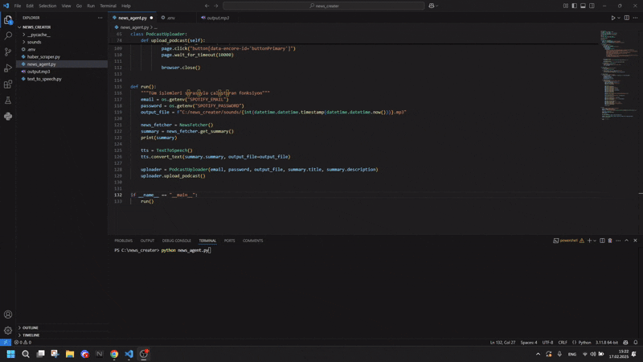

# AI-Powered News to Podcast Automation



## Overview

This project automates the process of extracting daily news from __ShiftDelete.net__, summarizing the content using __Pydantic-Ai__, converting the summaries into speech with __Eleven Labs__, and publishing the generated audio as a podcast on Spotify using __Playwright__.

## Features

📰 __Web Scraping__: Fetches daily news articles from ShiftDelete.net

🧠 __AI Summarization__: Uses pydantic-ai to generate concise and clear summaries

🔊 __Text-to-Speech (TTS)__: Converts summaries into natural-sounding speech via Eleven Labs

🎙 __Automated Podcast Upload__: Uploads the generated audio as a Spotify podcast using Playwright

⚡ __Fully Automated Pipeline__: Requires minimal human intervention once set up

## Tech Stack

__Python__ 🐍 (Core language)

__pydantic-ai__ 🤖 (AI-powered text summarization)

__BeautifulSoup & Requests__ 🌐 (Web scraping)

__Eleven Labs API__ 🔉 (Text-to-Speech conversion)

__Playwright__ 🎭 (Spotify podcast automation)

## Installation

### Prerequisites

Ensure you have __Python 3.8+__ installed and the following dependencies:
```
pip install beautifulsoup4 requests pydantic-ai playwright elevenlabs
```
Initialize Playwright:
```
playwright install
```
Usage

Run the script to fetch news, summarize, generate audio, and upload to Spotify:
```
python news_agent.py
```
The process runs automatically, generating a podcast episode for the latest news.

### Configuration

__API Keys and Spotify Account__: Set your API key and account in .env file
